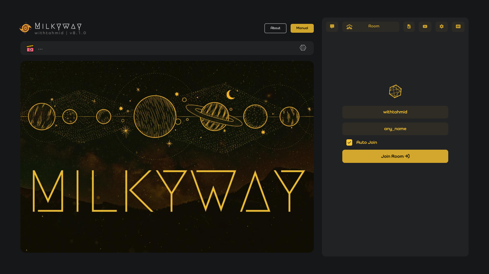
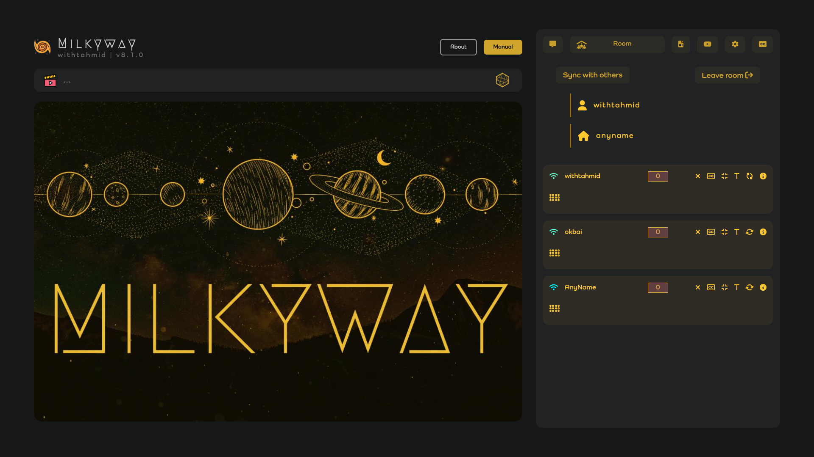
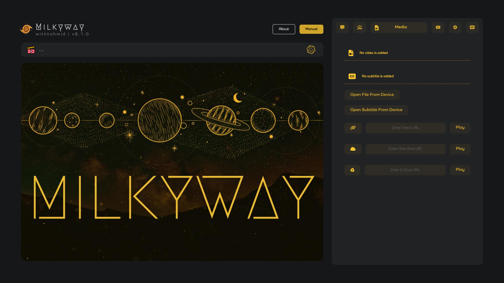
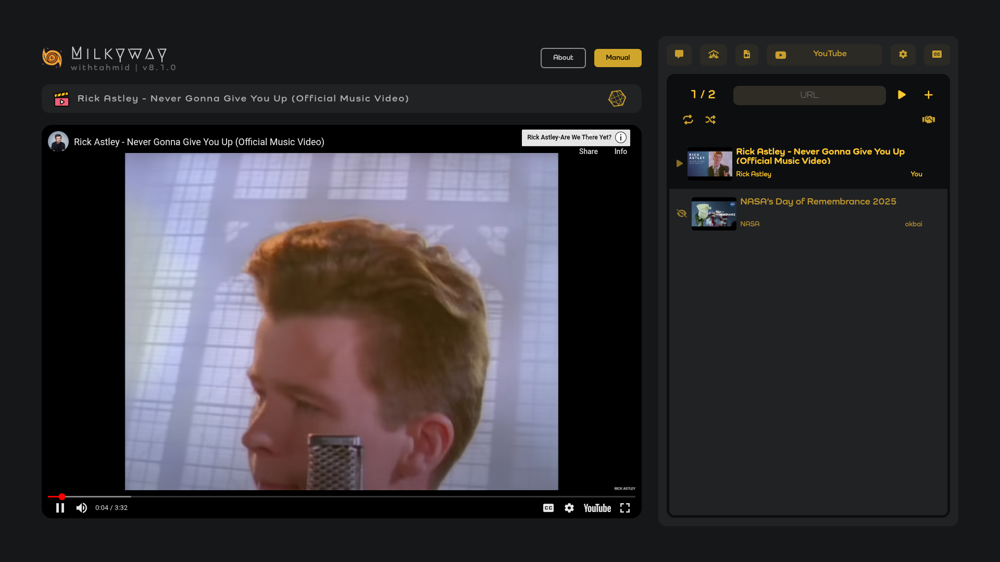
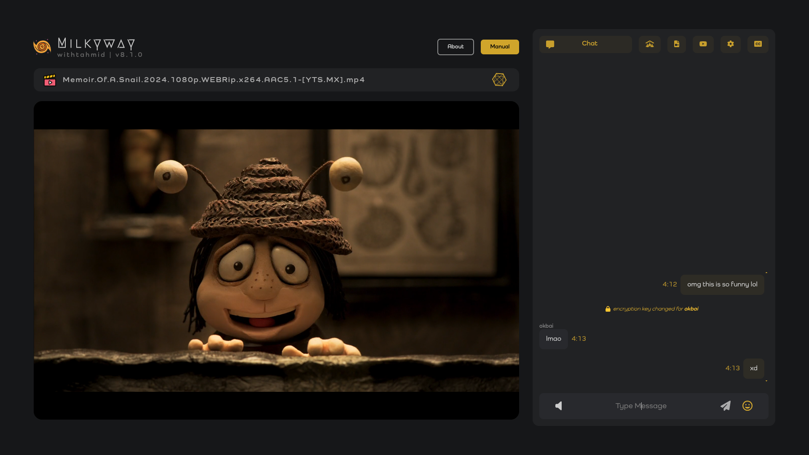
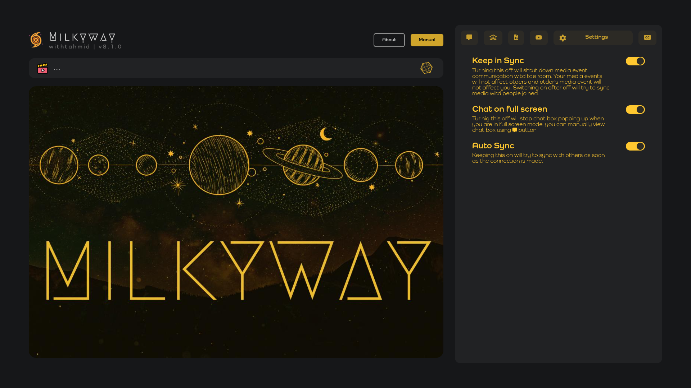
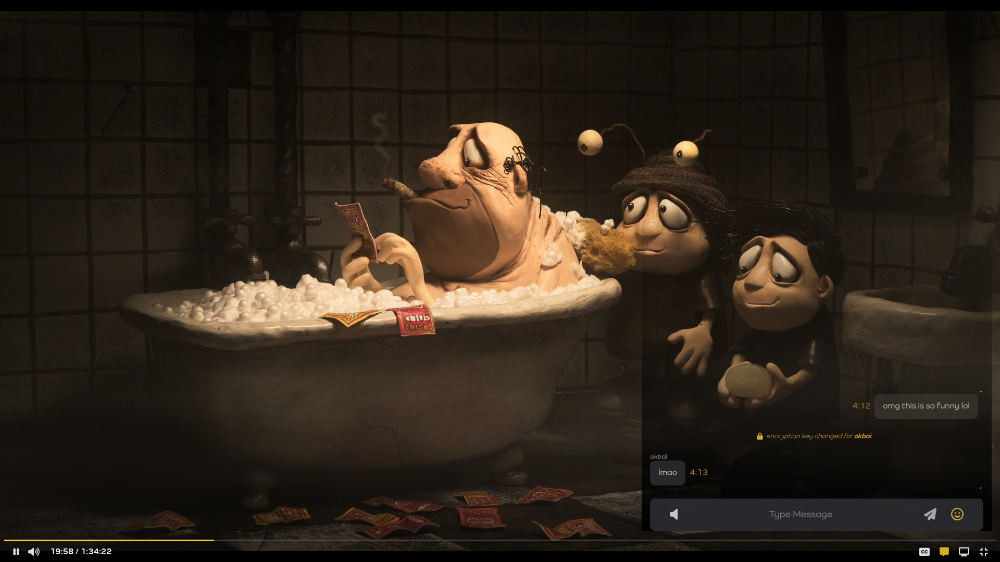

# Milkyway

Milkyway is a simple yet effective web application designed to provide a synchronized movie-watching experience for multiple users. Built with simplicity in mind, it does not rely on frameworks or a backend server, making it lightweight, free, and easy to use. It offers real-time video synchronization, end-to-end encrypted group chat, and more.

## Features

- **Synchronized Video Playback**: Multiple users in the same room can play, pause, or seek videos simultaneously in perfect sync.
- **Video Source Support**:
  - Local videos (recommended for high quality)
  - Google Drive
  - OneDrive
  - YouTube (with a personalized queue system)
- **Subtitles**: Supports `.vtt` subtitles and can convert `.srt` files to `.vtt` with padding.
- **End-to-End Encrypted Group Chat**:
  - Chat overlay visible even in full-screen mode.
  - Supports emojis.
- **User-Friendly Features**:
  - Username, room name, and settings are stored in `localStorage` for quick auto-join.
  - No login, payment, or personal information required.
- **Simplicity and Cost**:
  - Built using raw HTML, CSS, and Vanilla JavaScript.
  - Hosted on GitHub Pages with zero cost.

## How to Use

1. **Join a Room**:
   - Open the app in your browser.
   - Enter a `username` (can be anything).
   - Enter a `room name` (all users in the same room name will be synced).

2. **Add Videos**:
   - Choose a video from your local device, Google Drive, OneDrive, or YouTube.
   - Start playback to allow others in the room to sync.

3. **Chat and Interact**:
   - Use the chat box to send messages with end-to-end encryption.
   - Even in full-screen mode, the transparent chat overlay is available.

4. **Subtitles**:
   - Add `.vtt` subtitles directly.
   - If using `.srt` subtitles, convert them within the app to `.vtt` with padding.

## Technology Used

- **Web**: HTML, CSS, Vanilla JavaScript
- **Real-Time Communication**: MQTT (via a public broker server)

## Limitations

- No backend server means:
  - Once the browser is reloaded, all session data is wiped out (except for auto-join).
  - No data persistence.
- Reliance on a public MQTT broker may affect performance during high traffic.

## Future Enhancements

- Introduce a personalized and more reliable backend server with data persistence.
- Enhance performance and scalability.

## readme-screenshots

1. **Room Joining**
   

2. **After Joining the Room**
   

3. **Selecting Media**
   

4. **YouTube**
   

4. **Chat Interface**
   

5. **Settings**
   

6. **Full-Screen Video with Chat Overlay**
   

## Live Demo

You can access and use the app here: [Milkyway](https://withtahmid.github.io/milkyway)

Enjoy synchronized movie nights with Milkyway! 🚀